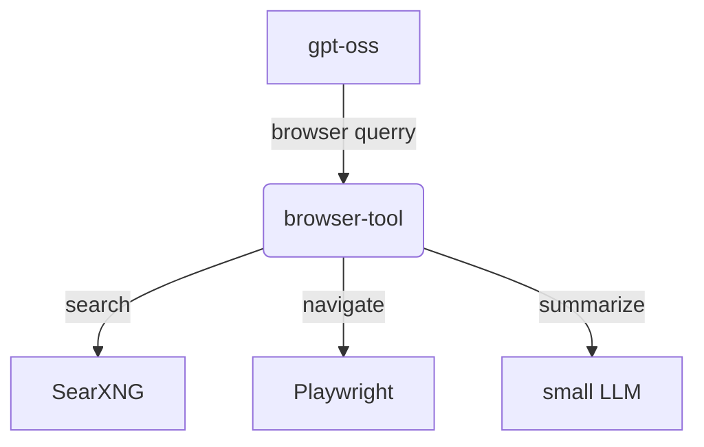

# Browser Tool API

A FastAPI-based web service that provides browser automation and web search capabilities using Playwright and SearXNG.
This is made to be a simple example of LLM tooling. MCP is not used, just basic web API calls to running server applications.
This tool is made to be run with gpt-oss. The API interface supports the call structure that gpt-oss uses.



For searching SearXNG is used running in a Docker container. This is a easy way to get full web searches without using a commercial API.
If how-ever you have a search provider API, the code is easily modified to work.
SearXNG must be installed and runnnig before this tool. (Link to instructions below)

This tool also uses a small LLM for text summarization.
Qwen3-1.7B-GGUF is a good start.
This model is run only on the container CPU, but by changing the CMAKE_ARGS and installing the needed packages in the Dockerfile a GPU can be used.


## Features

- **Web Search**: Search the web using your SearXNG instance
- **Web Navigation**: Navigate to URLs with optional element waiting
- **Content Extraction**: Extract clean text content from web pages
- **Text Summarization**: Summarize text using a local LLM (Llama)
- **Web Crawling**: Crawl websites with depth control (placeholder)

## Running local for testing
### Setup

SearXNG is needed for this to work, the easiest is to use the Docker version.
Instructions here: https://docs.searxng.org/admin/installation-docker.html

### Installing app
Clone the repo
```bash
git clone https://github.com/lupusmagist/browser-tool.git
```

1. Install dependencies:
```bash
cd browser-tool
python -m venv .venv
source .venv/bin/activate
pip install -r requirements.txt
playwright install chromium
```

2. Configure environment variables in `.env`:
The model specified here is a small model that will be used for text summarization.
eg: Qwen/Qwen3-1.7B-GGUF
The model location will be in the project folder.
The .env file will be slightly different depending if the app is run as a container and locally.

 - Locally:  
Look in local project root
```
LLM="./models/model.gguf"
SEARXNG_URL="path to your searXNG Server"
```

- Container:
```
LLM="/models/model.gguf"
SEARXNG_URL="path to your searXNG Server"
```

3. Run the server:
```bash
uvicorn app.main:app --host 0.0.0.0 --port 8000
```

### Testing API Endpoints

#### Web Search
Search the web using SearXNG.

```bash
curl -X POST "http://localhost:8000/web_search" \
  -H "Content-Type: application/json" \
  -d '{"query": "Python programming tutorials", "max_results": 5}'
```

**Request Body:**
- `query` (string, required): Search query
- `max_results` (integer, optional): Maximum number of results (default: 10)

**Response:**
```json
{
  "results": [
    {
      "title": "Result Title",
      "url": "https://example.com",
      "snippet": "Result description..."
    }
  ]
}
```

#### Navigate
Navigate to a URL with optional element waiting.

```bash
curl -X POST "http://localhost:8000/navigate" \
  -H "Content-Type: application/json" \
  -d '{"url": "https://example.com", "wait_for_element": ".content", "wait_time": 10}'
```

**Request Body:**
- `url` (string, required): URL to navigate to
- `wait_for_element` (string, optional): CSS selector to wait for
- `wait_time` (integer, optional): Timeout in seconds (default: 10)

#### Extract Content
Extract clean text content from a web page.

```bash
curl -X POST "http://localhost:8000/extract_content" \
  -H "Content-Type: application/json" \
  -d '{"url": "https://example.com"}'
```

**Request Body:**
- `url` (string, optional): URL to extract content from
- `wait_for_element` (string, optional): CSS selector to wait for

#### Summarize
Summarize text using a local LLM.

```bash
curl -X POST "http://localhost:8000/summarize" \
  -H "Content-Type: application/json" \
  -d '{"text": "Long text to summarize...", "max_tokens": 200}'
```

**Request Body:**
- `text` (string, required): Text to summarize
- `max_tokens` (integer, optional): Maximum tokens in summary (default: 200)

#### Crawl
Crawl a website with depth control (placeholder implementation).

```bash
curl -X POST "http://localhost:8000/crawl" \
  -H "Content-Type: application/json" \
  -d '{"url": "https://example.com", "max_depth": 2}'
```

**Request Body:**
- `url` (string, required): Starting URL
- `max_depth` (integer, optional): Maximum crawl depth (default: 2)

## Docker Support

Build and run with Docker:

```bash
docker-compose up -d
```

The Docker instance will look for the small model in the specified location in the docker-compose file
The default port used is set in the same manner.

## Unified Browser Tool Endpoint

The API provides a unified `/browser_tool` endpoint that handles multiple actions through a single interface. This is ideal for integration with llama-server for use with GPT-OSS.

### Usage Examples

**Search the web:**
```bash
curl -X POST "http://docker-host:8000/browser_tool" \
  -H "Content-Type: application/json" \
  -d '{"action": "search", "query": "Python tutorials", "max_results": 5}'
```

**Get page content:**
```bash
curl -X POST "http://docker-host:8000/browser_tool" \
  -H "Content-Type: application/json" \
  -d '{"action": "get_page", "url": "https://example.com"}'
```

**Summarize text:**
```bash
curl -X POST "http://docker-host:8000/browser_tool" \
  -H "Content-Type: application/json" \
  -d '{"action": "summarize", "text": "Long text to summarize...", "max_tokens": 200}'
```

## Notes

- The web search feature requires a running SearXNG instance
- The summarization feature requires a local LLM model in GGUF format
- Browser instances are automatically managed and cleaned up after each request
- The unified `/browser_tool` endpoint is recommended for llama-server integration
- Individual endpoints (`/web_search`, `/extract_content`, etc.) are available for direct API usage